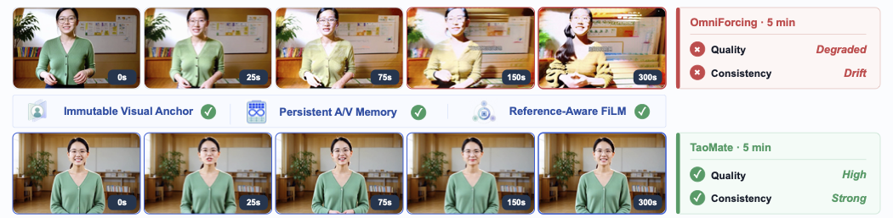

<div align="center">

<h1>
    TaoMate: Anchor-Guided Memory Bridging Evolving and Reference States for Real-Time Audio-Video Digital Human Generation
</h1>

<div>
    <a href='https://scholar.google.com/citations?user=qZvhvPcAAAAJ&hl=en' target='_blank'>Qijun Gan</a>*,&emsp;
    Chenwei Zhang,&emsp;
    <a href='https://scholar.google.com/citations?user=oi1LErsAAAAJ&hl=en' target='_blank'>Meiguang Jin</a>†,&emsp;
    Junfeng Ma,&emsp;
    <a href='https://scholar.google.com/citations?user=cFS40tMAAAAJ&hl=en&oi=sra' target='_blank'>Qiu Shen</a>&emsp;
</div>
<div>
    Alibaba Group - Taobao & Tmall Group
</div>
<div>
    * Project leader, † Corresponding author
</div>

<a href='https://arxiv.org/pdf/2607.24359' target='_blank'>Paper</a> | <a href='https://taoliveaigc.github.io/TaoMate' target='_blank'> Project Page</a> | <a href='https://huggingface.co/TaoLiveAIGC/TaoMate' target='_blank'>Model</a>

<div style="width: 100%; text-align: center; margin:auto;">
    
</div>


</div>
TaoMate is a real-time digital-human model for long-form audio-video generation. This repository provides the inference runtime, multi-GPU launchers, and the full interactive browser demo backed by a resident model worker.

## Interactive Demo

https://github.com/user-attachments/assets/4d2027de-49f2-433f-8c01-9345581640d5

## Requirements

- Linux x86_64
- Python 3.10
- `ffmpeg`, `tmux`, and `curl`
- One or two CUDA-capable NVIDIA GPUs for batch inference; four for the interactive demo
- NVIDIA driver compatible with CUDA 12.8

The reference 512x768 batch configuration and interactive demo have been validated on 72 GB GPUs.

## Installation

```bash
sudo apt-get update
sudo apt-get install -y build-essential cmake curl ffmpeg git tmux python3-venv

cd TaoMate
python3.10 -m venv .venv
source .venv/bin/activate
python -m pip install --upgrade pip

pip install torch==2.8.0 torchvision==0.23.0 torchaudio==2.8.0 \
  --index-url https://download.pytorch.org/whl/cu128
pip install -r requirements.txt
```

Verify the CUDA runtime before loading model weights:

```bash
python -c "import torch; print(torch.__version__, torch.cuda.device_count())"
```

The PyTorch version should start with `2.8.0` (the CUDA wheel may append
`+cu128`), and at least one GPU must be visible.

## Command-line Inference

Command-line inference requires the TaoMate checkpoint, the LTX-2.3 base model, and the Gemma 3 text encoder. Model weights are not included in this repository.

### Inference Models

| Variable | Contents |
| --- | --- |
| `MODEL_CKPT` | TaoMate `model.pt` from [TaoLiveAIGC/TaoMate](https://huggingface.co/TaoLiveAIGC/TaoMate) |
| `BASE_MODEL_CKPT` | LTX-2.3 `ltx-2.3-22b-dev.safetensors` checkpoint |
| `GEMMA_PATH` | Gemma 3 12B IT directory containing `config.json`, `preprocessor_config.json`, `tokenizer.model`, and `model*.safetensors` |

Keep checkpoints outside version control and provide absolute paths when launching inference. The repository ignores the local `models/` directory and common checkpoint extensions.

### Hugging Face Access

Install the official Hugging Face CLI, sign in, and create the local model directories:

```bash
python -m pip install --upgrade huggingface_hub
hf auth login

mkdir -p models/taomate models/ltx-2.3 models/gemma-3-12b-it
```

Accept the access terms on the [Gemma 3 12B IT model page](https://huggingface.co/google/gemma-3-12b-it) before downloading it. Review the license shown on every upstream model page before use.

### TaoMate Checkpoint

Download the TaoMate checkpoint and release manifest from [TaoLiveAIGC/TaoMate](https://huggingface.co/TaoLiveAIGC/TaoMate):

```bash
hf download TaoLiveAIGC/TaoMate model.pt \
  --local-dir models/taomate
hf download TaoLiveAIGC/TaoMate manifest.json \
  --local-dir models/taomate

echo "fb2b0ec8b709cfb27400c928930ab982940489fea6893e423851c41b8deb39be  models/taomate/model.pt" \
  | sha256sum --check
test -s models/taomate/manifest.json
```

Set `MODEL_CKPT` to `models/taomate/model.pt`.

### LTX-2.3 Base Model

Download the full BF16 development checkpoint from [Lightricks/LTX-2.3](https://huggingface.co/Lightricks/LTX-2.3):

```bash
hf download Lightricks/LTX-2.3 \
  ltx-2.3-22b-dev.safetensors \
  --local-dir models/ltx-2.3

test -s models/ltx-2.3/ltx-2.3-22b-dev.safetensors
```

Set `BASE_MODEL_CKPT` to the downloaded `.safetensors` file. Quantized, distilled, and upscaler checkpoints are not substitutes for this file.

### Gemma 3 Text Encoder

Download the complete [google/gemma-3-12b-it](https://huggingface.co/google/gemma-3-12b-it) repository. Do not download only its weight shards because the tokenizer and processor files are also required.

```bash
hf download google/gemma-3-12b-it \
  --local-dir models/gemma-3-12b-it

test -s models/gemma-3-12b-it/config.json
test -s models/gemma-3-12b-it/preprocessor_config.json
test -s models/gemma-3-12b-it/tokenizer.model
find models/gemma-3-12b-it -name 'model*.safetensors' -print -quit | grep -q .
```

Set `GEMMA_PATH` to the directory itself, not to an individual shard.

### Inference Paths

After downloading all required models, configure the model paths:

```bash
export MODEL_CKPT=$PWD/models/taomate/model.pt
export BASE_MODEL_CKPT=$PWD/models/ltx-2.3/ltx-2.3-22b-dev.safetensors
export GEMMA_PATH=$PWD/models/gemma-3-12b-it
```

### Input Format

Inference accepts a JSON list. Each case requires a unique `case_id` and 1 to 12 prompt segments. Each segment requires a prompt and seed.

```json
[
  {
    "case_id": "case_001",
    "description": "studio presenter",
    "segments": [
      {
        "prompt": "Eye-level tight medium close-up of a presenter speaking naturally to the camera.",
        "seed": 1001
      }
    ]
  }
]
```

Twelve segments produce approximately one minute of output. The included `configs/inference/benchmark_1min_windowed.json` contains 20 complete one-minute cases.

### GPU Memory

The following peaks were measured with `nvidia-smi` at 200 ms intervals on NVIDIA RTX PRO 5000 72GB GPUs. Both runs used the same prompt cache and seeds to generate one complete 60-second case with 12 prompt segments at 512x768 in BF16, including final video and audio decoding. The GPUs had no other compute processes during measurement.

| Mode | Peak per GPU | Simultaneous total peak |
| --- | ---: | ---: |
| Single GPU | 66.8 GiB | 66.8 GiB |
| Two GPUs | 33.6 GiB / 33.8 GiB | 67.2 GiB |

Actual memory use can vary with the GPU model, CUDA runtime, and output settings.
Both launchers create the prompt cache automatically when `PROMPT_CACHE` points to a file that does not yet exist.

### Single-GPU Inference

The single-GPU launcher loads the complete generator on one device.

```bash
MODEL_CKPT=$PWD/models/taomate/model.pt \
BASE_MODEL_CKPT=$PWD/models/ltx-2.3/ltx-2.3-22b-dev.safetensors \
GEMMA_PATH=$PWD/models/gemma-3-12b-it \
BENCHMARK_JSON=configs/inference/benchmark_1min_windowed.json \
PROMPT_CACHE=outputs/prompt_cache/benchmark.pt \
OUTPUT_DIR=outputs/taomate_single_gpu \
GPU=0 \
MAX_CASES=1 \
bash scripts/inference/run_taomate_1gpu.sh
```

### Two-GPU Inference

The two-GPU launcher splits the generator across both devices.

```bash
MODEL_CKPT=$PWD/models/taomate/model.pt \
BASE_MODEL_CKPT=$PWD/models/ltx-2.3/ltx-2.3-22b-dev.safetensors \
GEMMA_PATH=$PWD/models/gemma-3-12b-it \
BENCHMARK_JSON=configs/inference/benchmark_1min_windowed.json \
PROMPT_CACHE=outputs/prompt_cache/benchmark.pt \
OUTPUT_DIR=outputs/taomate_case001 \
GPU=0,1 \
MASTER_PORT=29780 \
MAX_CASES=1 \
bash scripts/inference/run_taomate_2gpu.sh
```

Completed videos are written to `OUTPUT_DIR` as `<case_id>.mp4`.

## Interactive Demo Deployment

The demo uses exactly four GPUs. GPUs 0-1 run the distributed generator, GPU 2 handles text conditioning and media decoding, and GPU 3 runs the local dialogue model together with lightweight ASR. The launcher starts the dialogue server, resident inference worker, and web service in separate tmux sessions.

It uses the three command-line inference models above and requires these additional components:

| Variable | Contents |
| --- | --- |
| `DIALOGUE_MODEL_PATH` | Gemma 4 26B A4B IT GGUF used for dialogue and prompt planning |
| `ASR_MODEL_PATH` | Local OpenAI Whisper `tiny.pt` checkpoint |
| `LLAMA_SERVER_BIN` | CUDA-enabled `llama-server` executable |

The Gemma 3 text encoder and Gemma 4 dialogue model serve different purposes and are not interchangeable.

### Dialogue LLM

The interactive demo was validated with the `UD-Q4_K_M` GGUF from [unsloth/gemma-4-26B-A4B-it-GGUF](https://huggingface.co/unsloth/gemma-4-26B-A4B-it-GGUF). The revision below pins the exact tested file.

```bash
mkdir -p models/dialogue
hf download unsloth/gemma-4-26B-A4B-it-GGUF \
  gemma-4-26B-A4B-it-UD-Q4_K_M.gguf \
  --revision b19ae878a3d8d38352d69c370321f94ff98023a0 \
  --local-dir models/dialogue

echo "34c746b1d50ab813e29cd46c4796e3f43c741901a582f93a67b55b9fc9687b35  models/dialogue/gemma-4-26B-A4B-it-UD-Q4_K_M.gguf" \
  | sha256sum --check
```

Build a CUDA-enabled `llama-server` from [ggml-org/llama.cpp](https://github.com/ggml-org/llama.cpp):

```bash
git clone https://github.com/ggml-org/llama.cpp.git third_party/llama.cpp
cmake -S third_party/llama.cpp -B third_party/llama.cpp/build \
  -DGGML_CUDA=ON -DCMAKE_BUILD_TYPE=Release
cmake --build third_party/llama.cpp/build \
  --config Release --target llama-server -j

test -x third_party/llama.cpp/build/bin/llama-server
```

The stack launcher starts and monitors this server automatically; no separate LLM service command is required.

### Whisper ASR

Download the official [OpenAI Whisper](https://github.com/openai/whisper) `tiny` checkpoint before starting the demo:

```bash
mkdir -p models/whisper
python -c "import whisper; whisper.load_model('tiny', device='cpu', download_root='models/whisper')"
test -s models/whisper/tiny.pt
```

Runtime downloads are disabled in the demo, so `ASR_MODEL_PATH` must point to this local file. Whisper is loaded by the web service and does not require a separate server.

### Start the Demo

```bash
MODEL_CKPT=$PWD/models/taomate/model.pt \
BASE_MODEL_CKPT=$PWD/models/ltx-2.3/ltx-2.3-22b-dev.safetensors \
GEMMA_PATH=$PWD/models/gemma-3-12b-it \
DIALOGUE_MODEL_PATH=$PWD/models/dialogue/gemma-4-26B-A4B-it-UD-Q4_K_M.gguf \
LLAMA_SERVER_BIN=$PWD/third_party/llama.cpp/build/bin/llama-server \
ASR_MODEL_PATH=$PWD/models/whisper/tiny.pt \
AVATAR_WORKER_CUDA_VISIBLE_DEVICES=0,1,2,3 \
AVATAR_RUNS_ROOT=outputs/interactive_avatar_runs \
AVATAR_PORT=7860 \
bash scripts/inference/start_interactive_avatar_stack.sh
```

The launcher prints live status for the dialogue server, website, worker, and resident model. It exits only after the demo is ready to use, then prints the URL, log directory, and shutdown command.

Open [http://127.0.0.1:7860/](http://127.0.0.1:7860/).

```bash
curl http://127.0.0.1:7860/readyz
tmux ls
```

Stop the demo with:

```bash
bash scripts/inference/stop_interactive_avatar_stack.sh
```

This closes `taomate_dialogue`, `taomate_worker`, and `taomate_service`. Logs are written to `outputs/service_logs` by default. Generated stream blocks and task status files are stored under `AVATAR_RUNS_ROOT`.

## Repository Layout

```text
apps/interactive_avatar/     Browser demo and persistent worker
configs/inference/           Example 20-case prompt JSON
ltx_causal/                  Streaming transformer and cache implementation
ltx_core/                    Decoder, text encoder, and weight loading components
ltx_pipelines/               Minimal inference model ledger
scripts/inference/           Batch and demo launchers
taomate/inference/            TaoMate inference runtime
```

## Citation

The official BibTeX entry will be added here upon release.

```bibtex
@misc{taomate2026,
      title={TaoMate: Anchor-Guided Memory Bridging Evolving and Reference States for Real-Time Audio-Video Digital Human Generation}, 
      author={Qijun Gan and Chenwei Zhang and Meiguang Jin and Junfeng Ma and Qiu Shen},
      year={2026},
      eprint={2607.24359},
      archivePrefix={arXiv},
      primaryClass={cs.CV},
      url={https://arxiv.org/abs/2607.24359}, 
}
```

## License

This project is released under the Apache 2.0 license. See `LICENSE` for details.

Third-party model weights remain subject to their own licenses and terms: [LTX-2.3](https://huggingface.co/Lightricks/LTX-2.3), [Omniforcing](https://github.com/OmniForcing/OmniForcing), [Gemma 3](https://huggingface.co/google/gemma-3-12b-it), [Gemma 4 GGUF](https://huggingface.co/unsloth/gemma-4-26B-A4B-it-GGUF), and [Whisper](https://github.com/openai/whisper).
